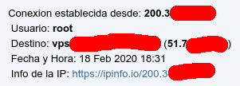

## Alerta via telegram cuando un usuario entra via SSH

Funciona en todas las distribuciones populares de linux. (Debian, Ubuntu, Arch Linux etc..)



### Requerimientos:
- curl
- zsh
- git (mas simple de instalar)

### Instalacion
1) Clonar o descargar a /opt/ folder
```cd /opt/ && git clone https://github.com/b-net/ssh-login-alert-telegram```

2) Edita las 2 varaibles en el archivo credentials.config:
```vim credentials.config```
En User ID poner el GROUP_ID o CHAT_ID (separados con espacio)
en KEY="Debe de ir el token"

### Ejemplo
```USERID=( -100000000995  -100666660996 )```

```KEY="3987987987:AAGP-7qda0918xbbbbxxxxxxx-WnEQ-0k"```

3) Ejecuta este script para instalar:
```bash deploy.sh```

4) Confirma que este funcionando correctamente, cerrando sesion y volviendo a entrar.


Fork de: MyTheValentinus 
